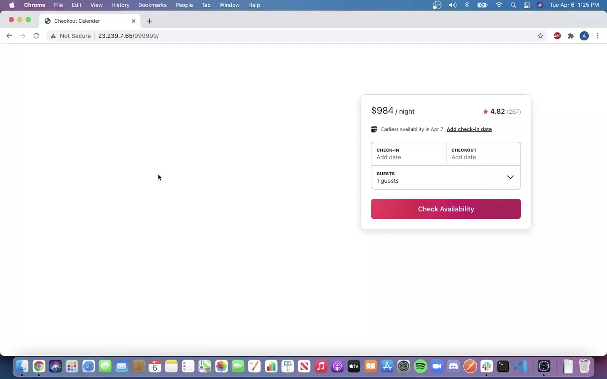

# Checkout Calendar

> Backend infrastructure for the checkout and availability component of a microservices-based vacation rental listing application which supports up to 1M listings and associated data such as 3-month availability (total ~90M records). Recreation of Airbnb calendar module.

Application scaled from 200 RPS to 600 RPS while keeping latency below 100 ms through implementation of horizontal scaling, Nginx load balancing, Redis caching, and PostgreSQL database tuning.

## Related Projects

  - https://github.com/Sonic-Design/photo-carousel
  - https://github.com/Sonic-Design/reviews
  - https://github.com/Sonic-Design/photoGallery

  - Original project: https://github.com/the-casuals/casual-checkout-service
