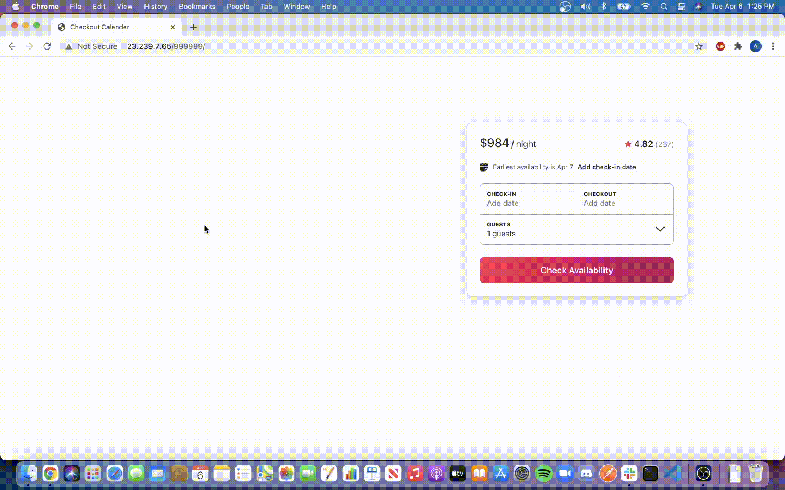

# Checkout Calendar

> Create a home listing page for a vacation rental application using a service based architecture in order to support up to 1M listings.



## Related Projects

  - https://github.com/Sonic-Design/photo-carousel
  - https://github.com/Sonic-Design/reviews
  - https://github.com/Sonic-Design/photoGallery

  - Original project: https://github.com/the-casuals/casual-checkout-service

## Table of Contents
1. [Usage](#Usage)
1. [Requirements](#requirements)
1. [Development](#development)

## Usage

> To run webpack, change webpack config mode to development or production according to needs then run
  npm run react-dev
> To start local server run npm start
> To seed database run npm run seed

## Requirements

An `nvmrc` file is included if using [nvm](https://github.com/creationix/nvm).

- Node 6.13.0
- etc

## Development

### Installing Dependencies

From within the root directory:

```sh
npm install
```
